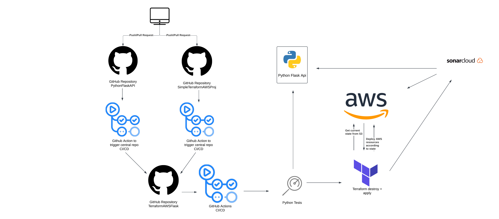

# TerraformAWSFlask

TerraformAWSFlask is the central repository that orchestrates the deployment and testing of infrastructure and application code for a Flask API connected to a MySQL database. It combines workflows from the SimpleTerraformAWSProj and PythonFlaskApi repositories to ensure a unified CI/CD process.

## Table of Contents
- [Purpose](#purpose)
- [Features](#features)
- [Requirements](#requirements)
- [CI/CD Workflow](#cicd-workflow)

## Purpose
This repository centralizes the continuous integration and deployment pipeline for the following:
- **Infrastructure Deployment:** Uses the SimpleTerraformAWSProj repository to deploy AWS resources such as an EC2 instance, an RDS MySQL database, and networking components.
- **Application Testing:** Ensures the PythonFlaskApi project is deployed and tested after the infrastructure is in place.

The goal is to provide a streamlined process for provisioning, testing, and validating the end-to-end deployment.

## Features
- Triggers unified CI/CD workflows upon changes in linked repositories (SimpleTerraformAWSProj and PythonFlaskApi).
- Deploys AWS infrastructure using Terraform.
- Tests the Flask API and validates its integration with the deployed RDS MySQL database.
- Performs static code analysis with SonarCloud.

## Requirements
- GitHub Actions enabled in the repository.
- Secrets for authentication and access management:
    - **AWS_ACCESS_KEY_ID**
    - **AWS_SECRET_ACCESS_KEY**
    - **AWS_SESSION_TOKEN** (optional)
    - **GIT_TOKEN** for repository access.
    - **SONAR_TOKEN** for SonarCloud integration.

## CI/CD Workflow
This repository uses GitHub Actions to manage the CI/CD process and the workflow performs the following steps:

### Workflow Steps
1. **Terraform Destroy:**
    - Ensures any existing infrastructure is destroyed before applying new changes.
    - Uses the `SimpleTerraformAWSProj` repository to manage Terraform configurations.

2. **Terraform Apply:**
    - Deploys the AWS infrastructure required for the Flask API, including EC2, RDS, and networking resources.

3. **Python Application Tests:**
    - Runs tests on the PythonFlaskApi project to validate its functionality and integration with the deployed infrastructure.

4. **SonarCloud Analysis:**
    - Performs static code analysis on the PythonFlaskApi project to ensure code quality.

The following diagram illustrates the CI/CD workflow:

## Linked Repositories
- **[SimpleTerraformAWSProj](https://github.com/Skyphoenixx/SimpleTerraformAWSProj):** Manages the Terraform configuration and AWS resource provisioning.
- **[PythonFlaskApi](https://github.com/Skyphoenixx/PythonFlaskApi):** Contains the Flask API code and tests.

## Usage
1. **Triggering Automatically:**
    - Changes in SimpleTerraformAWSProj or PythonFlaskApi automatically dispatch a `repository_dispatch` event to this repository.
2. **Manual Triggering:**
    - Navigate to the GitHub Actions tab.
    - Select the "Full Pipeline" workflow.
    - Click "Run workflow" and provide the necessary input (e.g., `full_pipeline` or `destroy`).

This repository simplifies managing the deployment and testing of a Flask API and its associated infrastructure in a unified way.

